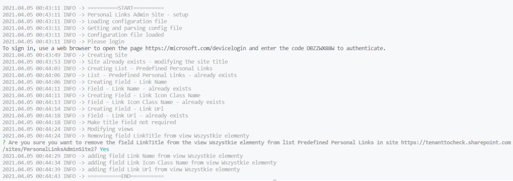
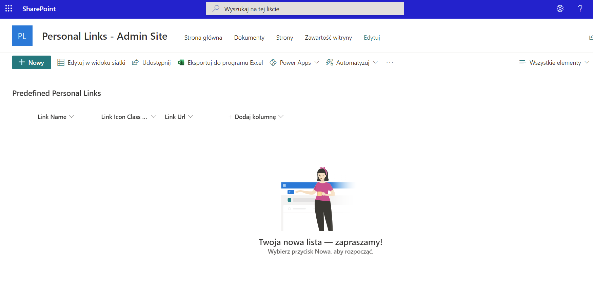

# Personal Links Admin Site

## 📝 Description

This part allows to add an admin site with a list (dedicated for admins) which will allow to predefine links that a user may add from personal links webpart. This functionality will allow the organization to create a set of links dedicated for all users.

## 🚀 How to run

in order to run the script please be sure to install [CLI for Microsoft 365](https://pnp.github.io/cli-microsoft365/) installed as the script uses it.

simply run the setup script in powershell 

```
.\createAdminSite.ps1
```

## 📸 Result

running the setup script should look like


the output of the script should be a site with a predefined list created


## ⚠ Disclaimer

This code is provided as is without warranty of any kind, either express or implied, including any implied warranties of fitness for a particular purpose, merchantability, or non-infringement.
