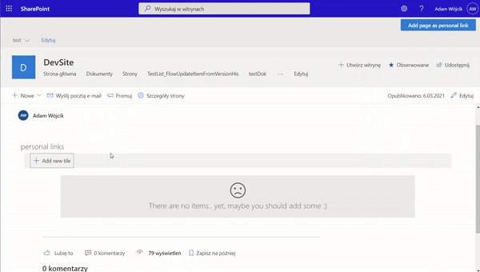
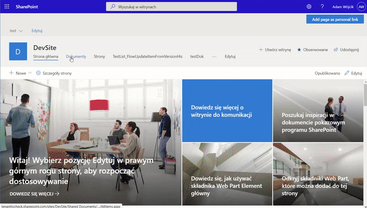
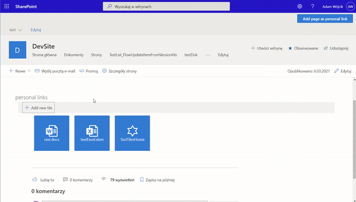
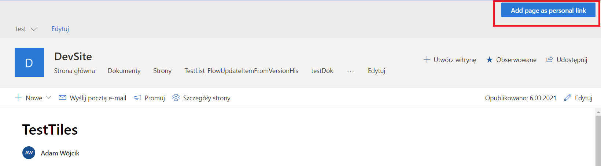
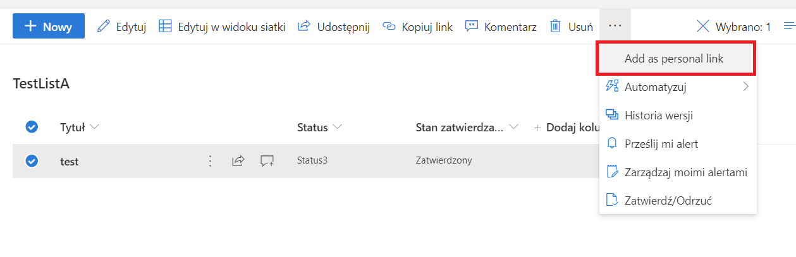
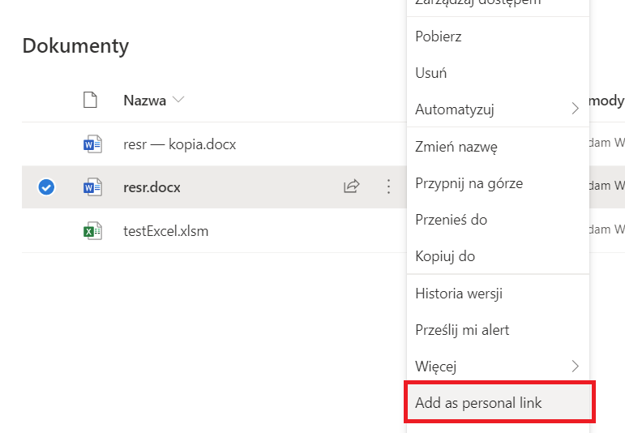
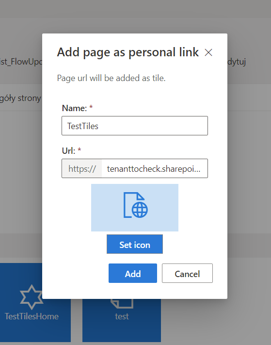

# Personal Links Extension

## 📝 Description
The extensions adds button to the top bar (header) of every page on the site and to the top bar and context menu of every item, folder or file in every list or library. The button present a dialog with prefield fields based on page or item data and allows to add a tile (personal link) to that specifc page or item.

## 🚀 How to run
1. simply clone the repo
2. run `gulp bundle --ship && gulp package-solution --ship` to build the solution
3. deploy the .sppkg file from the ..\sharepoint\solution catalog to your SharePoint tenant
4. go to API management page and approve the Graph API permissions requested by the webpart, like described in [MSD documentation - deploy the solution and grant permissions](https://docs.microsoft.com/en-us/sharepoint/dev/spfx/use-aad-tutorial#deploy-the-solution-and-grant-permissions)

## 📸 results
How it works

Extension places

Site header

List/Lib top bar

List/Lib context menu

Dialog that allows to add the personal link for specified page or item

## ⚠ Disclaimer
This code is provided as is without warranty of any kind, either express or implied, including any implied warranties of fitness for a particular purpose, merchantability, or non-infringement.
