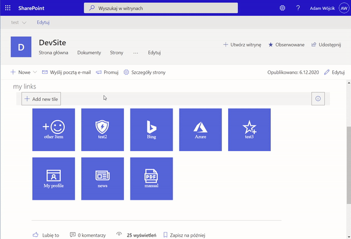
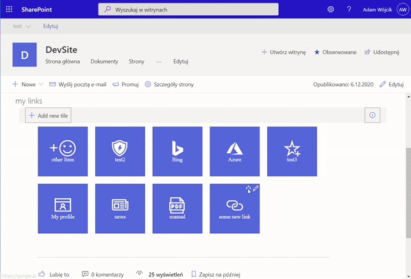
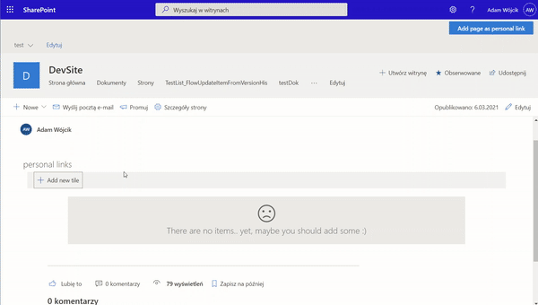

# Personal Links solution

## 📝 Description

This solution provides functionality which may be added to any SharePoint page (as full webpart page as well) or as personal app in teams and teams tab. The solution is build from the following components(parts) which may be found in separate catalogs:

- [Webpart](https://github.com/Adam-it/TilesLinksForSPOnline/tree/master/Webpart) - this is the main component of the solution. It provides a personalized view for links. This provides an another way of navigation that may be created by the user to content that is important for them. The webpart may be added as teams personal app and teams tab. User links are saved in a json file in their OneDrive app catalog folder.

- [AdminSite](https://github.com/Adam-it/TilesLinksForSPOnline/tree/master/AdminSite) - this is a setup script in PowerShell which uses [CLI for Microsoft 365](https://pnp.github.io/cli-microsoft365/) to create a SharePoint site with a list which will store predefined links. The items are then used in the webpart as proposals of links the user may add to his personal list.
- [Extension](https://github.com/Adam-it/TilesLinksForSPOnline/tree/master/Extension) - this is solution has two components. An Application Customizer which will a header on every SharePoint page with a button which will allow to add the current page link as a new personal link and a Command Set which will be added to every SharePoint list and Library allowing to add a link to the current selected item as a new personal link.
 

 

In future I want to extend this with extensions for sites and lists that will allow to add a personal link from any point of SharePoint and with some kind of admin app (maybe some console application or other 🤔) which will allow to add not removable links for other users by the company. 

This kind of solution gives an another personalized navigation for an Intranet portal which the users may create themselves. 

## 💡 Contributing

Sure why not. If you have ideas for new features or feedback, create an issue in the [issues list](https://github.com/Adam-it/TilesLinksForSPOnline/issues).

## 🧑‍💻 Technologies

[SPFx 1.16.1](https://learn.microsoft.com/en-us/sharepoint/dev/spfx/release-1.16.1)

## ⚠ Disclaimer

This code is provided as is without warranty of any kind, either express or implied, including any implied warranties of fitness for a particular purpose, merchantability, or non-infringement.