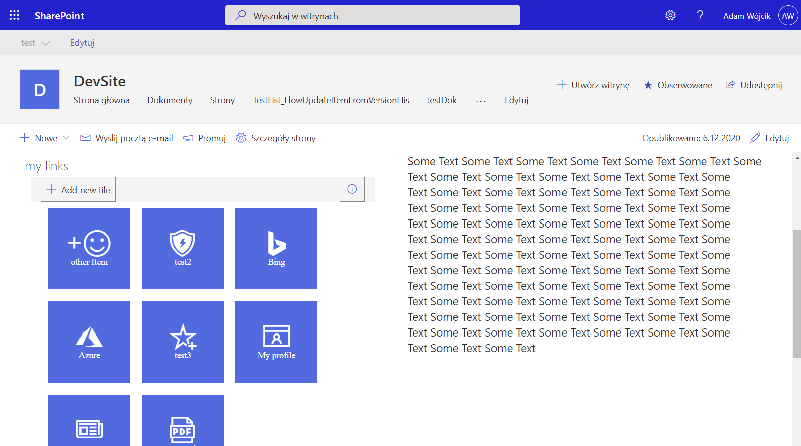
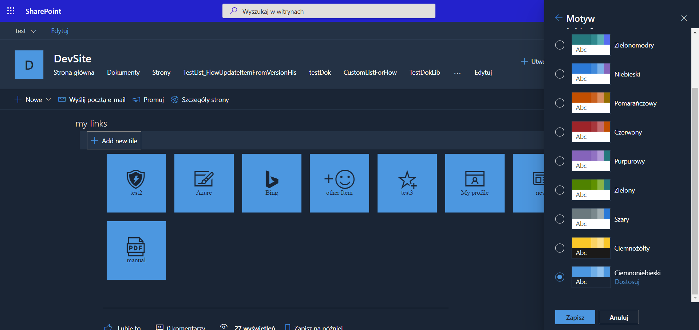
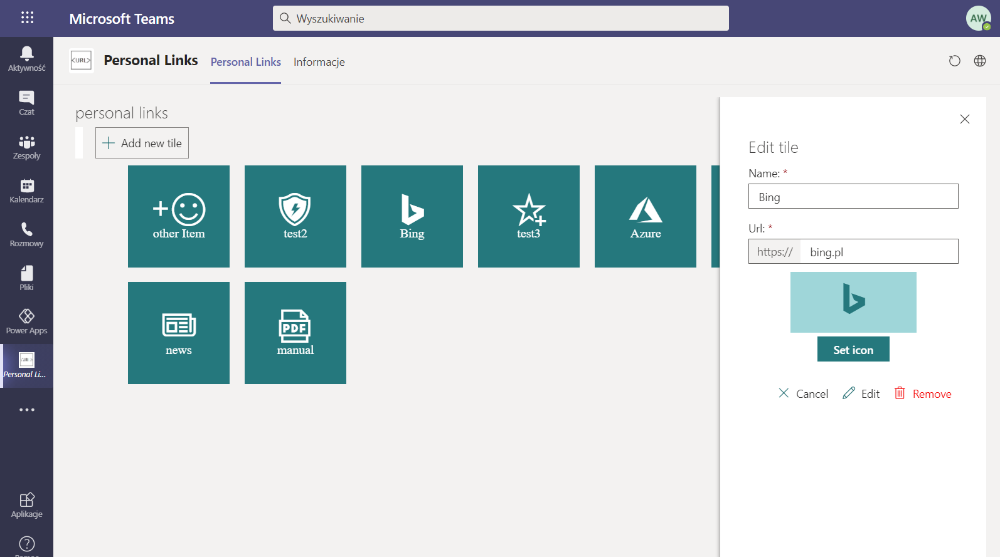

# Personal Links

## 📝 Description
This webpart provides a personalized view for links. This provides an another way of navigation that may be created by the user to content that is important for them. The webpart may be added as teams personal app and teams tab. User links are saved in a json file in their OneDrive app catalog folder.

## 🚀 How to run
1. simply clone the repo
2. run `gulp bundle --ship && gulp package-solution --ship` to build the solution
3. deploy the .sppkg file from the ..\sharepoint\solution catalog to your SharePoint tenant
... please remember that if you plan to use the webpart in teams mark the 'Make this solution available to all sites in the organization' during deploy and then use the 'Sync to teams'

4. go to API management page and approve the Graph API permissions requested by the webpart, like described in [MSD documentation - deploy the solution and grant permissions](https://docs.microsoft.com/en-us/sharepoint/dev/spfx/use-aad-tutorial#deploy-the-solution-and-grant-permissions)

## 📸 results

adding webpart to the page

this is how the webpart looks in SharePoint

this is how we may add links

and as webpart full page

webpart supports SharePoint themes 

adding webpart to teams

this is how the webpart will look like in teams tab

teams personal app

## ToDo
#### what I want to add for this solution 🤔
- [ ] unit tests... ye ye I know.. should have done it long ego 😅
- [x] github action to deploy on each push to master branch using OF 365 CLI actions
- [x] I want to add icons to the tiles... so that the user may add icons to personal links

## ⚠ Disclaimer
This code is provided as is without warranty of any kind, either express or implied, including any implied warranties of fitness for a particular purpose, merchantability, or non-infringement.
