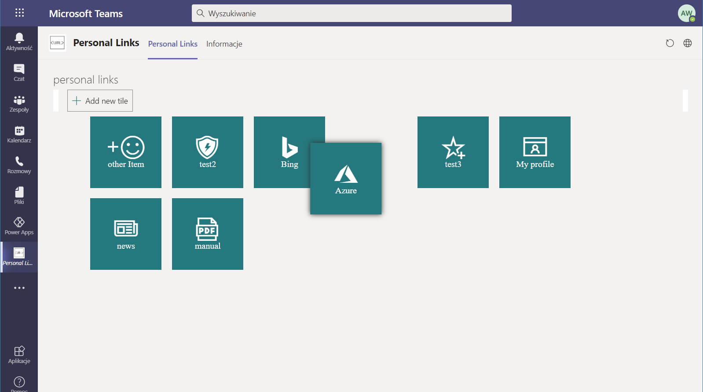
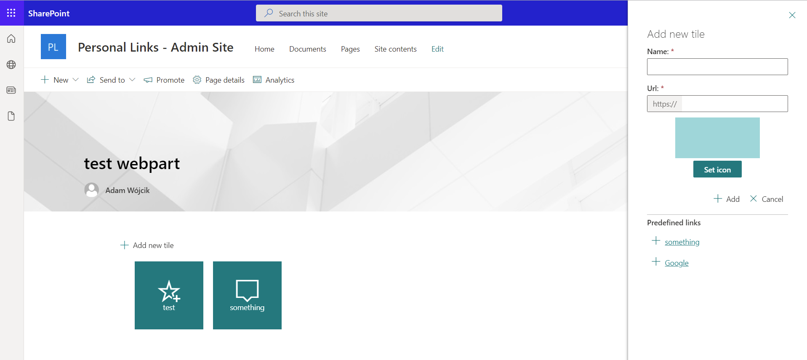

# Personal Links Webpart

## 📝 Description
This webpart provides a personalized view for links. This provides an another way of navigation that may be created by the user to content that is important for them. The webpart may be added as teams personal app and teams tab. User links are saved in a json file in their OneDrive app catalog folder.

## 🚀 How to run
1. simply clone the repo
2. run `gulp bundle --ship && gulp package-solution --ship` to build the solution
3. deploy the .sppkg file from the ..\sharepoint\solution catalog to your SharePoint tenant
... please remember that if you plan to use the webpart in teams mark the 'Make this solution available to all sites in the organization' during deploy and then use the 'Sync to teams'

4. go to API management page and approve the Graph API permissions requested by the webpart, like described in [MSD documentation - deploy the solution and grant permissions](https://docs.microsoft.com/en-us/sharepoint/dev/spfx/use-aad-tutorial#deploy-the-solution-and-grant-permissions)

## 📸 results

adding webpart to the page

this is how the webpart looks in SharePoint

this is how we may add links

and as webpart full page

webpart supports SharePoint themes 

adding webpart to teams

this is how the webpart will look like in teams tab

teams personal app

## predefined links (optional setting)
1. step is to setup an admin site with predifined links list. In order to do that please fallow the README.md present in AdminSite  folder
2. is to populate adminSite property in GlobalSettings.ts with the url of the admin site created in previous step.
3. deploy the updated version of the webpart

... thats all. After that user when adding new link be able to see (only if some links were added to the SP list) a predefined list with links the user may just add with a single click.

## ⚠ Disclaimer
This code is provided as is without warranty of any kind, either express or implied, including any implied warranties of fitness for a particular purpose, merchantability, or non-infringement.
